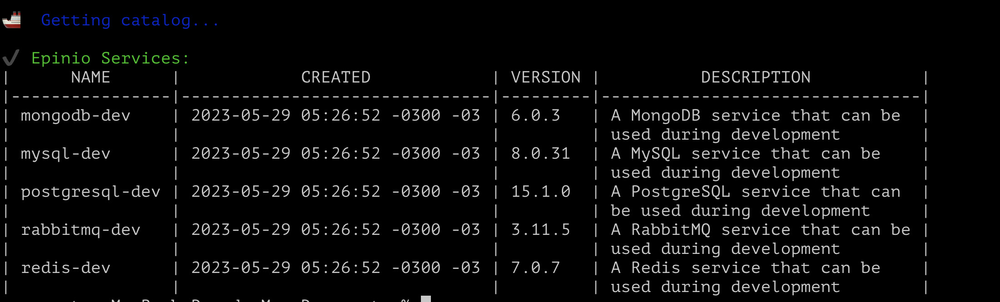

# Improving the deploying

We created a cluster where we deployed some services. We also enabled add-ons such as csi driver, policies etc. So it was a lot of commands just to create a cluster and configure it. A best practice would be using Terraform or Crossplane to provisioning the infrastructure. Here we'll use Crossplane to provision the infrastructure, eksctl-yaml to create the cluster and Epinio to deploy the application. 

We'll leverage the integration of Crossplane and Epinio. They make very easy the process of provisioning and deploy. So, we will create services on Epinio catalog using crossplane.

# Create the EKS cluster using eksctl-yaml

Navigate to cluster folder and run the following command to create the cluster. 

```bash
eksctl create cluster -f cluster.yaml
```

# Deploy Amazon EBS CSI Driver
- navigate to ebs folder. 
- - Use this json to create a policy and run the command: <br>
```bash
aws iam create-policy --policy-name amazon_ebs_csi_driver --policy-document file://ebs_csi.json
```

```json
{
  "Version": "2012-10-17",
  "Statement": [
    {
      "Effect": "Allow",
      "Action": [
        "ec2:AttachVolume",
        "ec2:CreateSnapshot",
        "ec2:CreateTags",
        "ec2:CreateVolume",
        "ec2:DeleteSnapshot",
        "ec2:DeleteTags",
        "ec2:DeleteVolume",
        "ec2:DescribeInstances",
        "ec2:DescribeSnapshots",
        "ec2:DescribeTags",
        "ec2:DescribeVolumes",
        "ec2:DetachVolume"
      ],
      "Resource": "*"
    }
  ]
}
```

# Deploy the CSI Driver
```bash
kubectl apply -k "github.com/kubernetes-sigs/aws-ebs-csi-driver/deploy/kubernetes/overlays/stable/?ref=master"
```

# Install Cert-Manager:
```bash
helm repo add jetstack https://charts.jetstack.io
helm repo update
helm upgrade --install cert-manager jetstack/cert-manager --namespace cert-manager  \
    --set installCRDs=true \
    --set extraArgs={--enable-certificate-owner-ref=true} \
    --create-namespace
```

# Install Nginx Ingress Controller:
```bash
helm upgrade --install nginx-ingress --namespace nginx-ingress nginx-stable/nginx-ingress \
    --set controller.setAsDefaultIngress=true \
    --create-namespace
```

# Install Epinio
```bash
helm repo add epinio https://epinio.github.io/helm-charts
helm repo update
helm upgrade --install epinio epinio/epinio --namespace epinio --create-namespace \
    --set global.domain=myepiniodomain.org
```

# Install Crossplane
```bash
helm install crossplane \
    --create-namespace --namespace crossplane-system \
    crossplane-stable/crossplane \
    --set args={--enable-external-secret-stores}
```

- Navigate to crossplane folder and apply it to create the file: <br>
```bash
kubectl apply --file provider-aws.yaml
``` 

- Let's create a service in the epinio catalog. We'll deploy a elasticache-redis. 
- - These are the available services in my epinio: <br>
```bash 
epinio service catalog
```


- Epinio services are descriptions of Helm charts. Before deploy custom services we have to package these services using helm.
- - Navigate to crossplane/epinio-services and run the following commands: <br> 
```bash
helm package ./elasticache -n epinio
```

